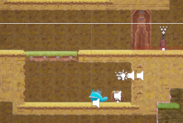
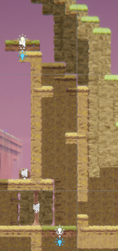
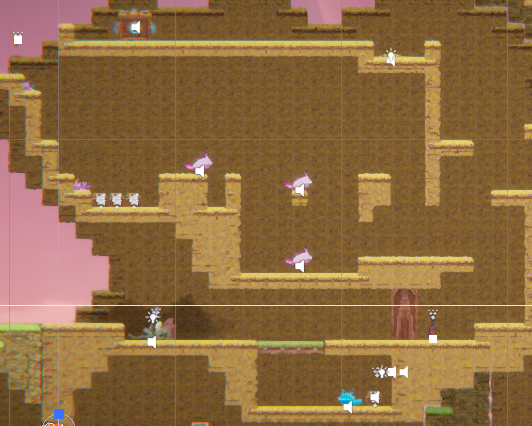
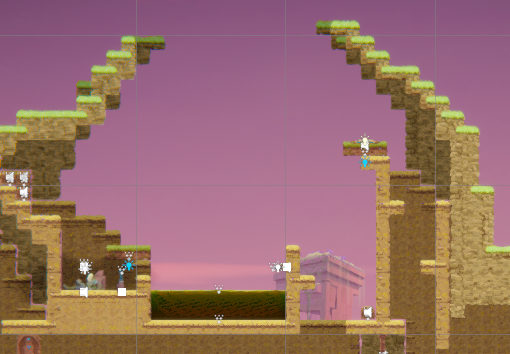
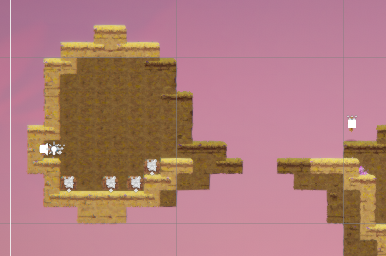
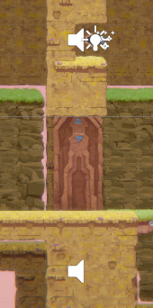
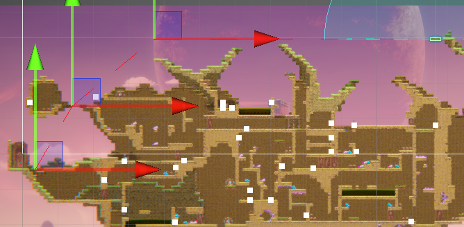
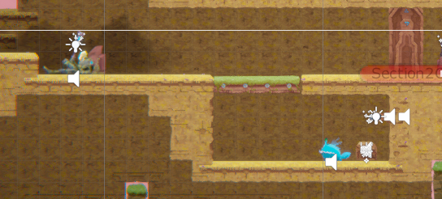
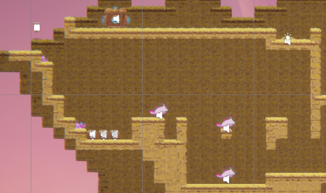
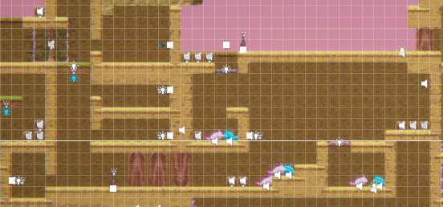

[](https://classroom.github.com/a/YyUO0xtt)
# COMP2150  - Level Design Document
### Name: [Soo Hwan Kim]
### Student number: [47517891] 

This document discusses and reflects on the design of your platformer level for the Level Design assessment. It should be 1500 words. Make sure you delete this and all other instructional text throughout the document before checking your word count prior to submission. Hint: You can check word count by copying this text into a Word or Google doc.

Your document must include images. To insert an image into your documentation, place it in the "DocImages" folder in this repo, then place the below text where you want the image to appear:

```

```

Example:


## 1. Player Experience (~700 words)
Outline and justify how your level design facilitates the core player experience goals outlined in the assignment spec. Each section should be supported by specific examples and screenshots of your game encounters that highlight design choices made to facilitate that particular experience.

### 1.1. Discovery
What does the player learn? How does your encounter and broader level design facilitate learning in a way that follows good design practice?

The player learns more of how to play the game, encouraging experimentation with various dynamics emerging from within the game's systems, such as gauging plausible distances from the jump height, and length, through various "subscenes" that make up each level. I encouraged this through the morphology of familiar scenes, first introducing the concepts in a safe and isolated manner, before widening its scope into alternate and combined uses. 

An example of this is in the first section of the game, where players are introduced to the rules of damage and switches, and the verb of melee attacks. 

 

The player is expected to take damage while attempting this section, with the staff pickup right before it prompting the player to see how they can reach down and deal with the spitter. I isolated the idea of players being able to drop through platforms, and being able to deal damage, in order to familiarise them with the mechanic. 

I reinforced this through the introduction of the chompers and aerial attacks in the section right above it, teaching the player alternate uses of the verb given, as well as approximate distance parameters of the jump verb, and how the players can modulate their appraoch to jumping, through the spikes leading to the second part of the section. 

![A chamber comprised of 2 sections, upper and lower. The lower section has a sheer cliff leading up to the upper, with a segment on the right and a singular floating block leading to it, occupied by a chomper. The floor is occupied by a chomper, and a chomper spawner. The upper section is a flat area with a block on it, and a pressure plate on the right. Connecting those two is another cliff that has spikes set in indents on its side. Health pickups are just below these spikes, which the knockback from those spikes seem to push the player into.](DocImages/FirstSectionParamsExample.png)

I designed the geometry of the room to make the spikes' knockback push the player into one of the health pickups, helping to maintain a flow state as they attempt to discover ways to get through the spikes. 


### 1.2. Drama
What is the intensity curve? How does your design facilitate increasing yet modulating intensity, with moments of tension and relief? 

My design invokes Drama through use and exploration of the known to influence the player's experiential arc. This is primarily done through the modulation of physical, perceptive, and intellectual challenge over time, through the player's movement through the spacce given. 

Borrowing from the Gamer Motivation Model, I focused on the target experience of Mastery to inform my design process in modulating difficulty, creating first smaller subscenes for players to learn at a lower intensity, before raising it in later sections through demanding alternate and combined use of verbs. To create breaks from such tension, I used the connective spaces between spaces to create resonance, through the environmental design, with scenic sections the player had to walk through to get to the next parts of the game. 

 

Additionally, I subverted this resonance after this scene, through heavy usage of spikes creating a dodging challenge that, while not truly threatening, as the health pickups just prior and after this scene create little risk for the player objectively, the drastic increase in spikes, and subversion of what felt like a "safe space", created anticipation for the sections ahead. 

 


### 1.3. Challenge
What are the main challenges? How have you designed and balanced these challenges to control the difficulty curve and keep the player in the flow channel?

The player experiences various forms of Challenge, in the form of Intellectual, Perceptual, and Physical, balanced through the isolation of various segments to allow players to explore the various verbs given to them, before showing alternative uses, then demanding players to combine various verbs to successfully complete the later sections, composed of the same ideas shown prior. 

I ensured players would have the intrinsic skills to overcome these challenges through this approach, as demonstrated by the precision section of Level 3 having taken the delayed jump movement learned from the spike section in the first level, the breakable walls and vertical movement from the first section of the second level, and the crouch shooting learned from the run and gun section in the latter part of the second level, creating a path through this section that players are guaranteed to know how to solve. 

 


 

 

### 1.4. Exploration
How does your level design facilitate autonomy and invite the player to explore? How do your aesthetic and layout choices create distinct and memorable spaces and/or places?

My design invoked exporation through autonomy in the ways the player could overcome the obstacles presented, and in the optional section presented. I furthered this through the aesthetic shifts in each section, to add to moments within the game's dramatic arc, thereby creating distinct and memorable spaces, and to reward curiosity. 

I furthered the dramatic arc with different environments, moving through general cave structures, to open atmosphere areas, to crystal mines, to correlate with the rising tension and releases found within the game's difficulty curve. Through this variety in aesthetic environments, I encouraged curiosity in upcoming sections. 

 

 

 

I created a secret section that could only be accessed with the gun, through a floating island off the second section of the first level, that's impossible to reach without either a running start, or by swinging the staff in midair. Accessing this area provided the player with an alternate view of the corridor leading to the third level, and above it, a moving platform that allowed the player to "touch the moon", moving the player back to the start of the level, if they had shot a switch hanging above the door at the end of the third level. As I expected players to forget about the section until they finished and arrived back at the starting section, this was a way to remind, and reward curious players who went back to see what else the game had to offer. 

 

 

 

 

## 2. Core Gameplay (~400 words)
A section on Core Gameplay, where storyboards are used to outline how you introduce the player to each of the required gameplay elements in the first section of the game. Storyboards should follow the format provided in lectures.

Storyboards can be combined when multiple mechanics are introduced within a single encounter. Each section should include a sentence or two to briefly justify why you chose to introduce the mechanic/s to the player in that sequence.

You should restructure the headings below to match the order they appear in your level.


### 2.1. Passthrough Platforms, Spitters, Weapon pickup, Health Pickups 

 

I chose to start the level with this section, as it was something that immediately put players into action, and created a dynamic between the player and enemies that wasn't just to run away. I used a passthrough platform, as I expected this to be something that the player is familiar with, and used the spitter here to introduce them to the player in a way that could be easily dealt with. Additionally, this section taught the player about switches, and what they can do, something that came up a lot in my design that I felt was important the player came to terms with quickly. 

I added the health pickup here, as I expected players to get hit, and in hitting the switch, would collide with the pickup, discovering this mechanic organically. 

 

### 2.2. Chompers, Spikes, Keys 

 

I introduced the chompers here, alongside the basics of platforming, to reinforce the dynamic between the player and the enemies, and to get the player used to dealing with them in tandem with other obstacles. Due to the geometry, the chompers appear threatening due to their proximity, but are easily either avoided or killed by the player's superior mobility. 

I introduced the spikes in this section, to build off the basics of platforming presented just before, and to teach precision with their movement, as it was another cornerstone of platformers I felt players needed to be accustomed to early. I decided to add the key here as an additional reward for successfully completing this task. 

 

### 2.3. Acid, Checkpoints, Moving Platforms 

 

I introduced the acid here, as I believed that the player had adequately adapted to most of the rules of platforming in this game, and acid with the respawn point would further reinforce the ideas the player had of the jumping properties. While a checkpoint was available earlier, it would likely have seen its first use here, as I expect the player to first attempt the jump over the acid. As the player respawned, I expected them to then explore the area, and see if they could break the wall that was just a bit ahead. 

I reinforced this through the placement of the checkpoint, making the player walk more forwards, to break them out of possible repetition by giving them time to think, while not pulling them out of the game. I used platforms first with a pressure plate to demonstrate this idea, then with a switch only activatable with the gun, to set up for the run and gun section ahead. 

 

### 2.4. Weapon Pickup (Gun)

 

While the gun was technically introduced in the section just before, I made sure to introduce it more holistically in this section, combining it with enemies, and a unique application of the pressure plates in removing the weight, to stress test what I had just demonstrated prior. 

 

## 3. Spatiotemporal Design
A section on Spatiotemporal Design, which includes your molecule diagram and annotated level maps (one for each main section of your level). These diagrams may be made digitally or by hand, but must not be created from screenshots of your game. The annotated level maps should show the structure you intend to build, included game elements, and the path the player is expected to take through the level. Examples of these diagrams are included in the level design lectures.

No additional words are necessary for this section (any words should only be within your images/diagrams).
 
### 3.1. Molecule Diagram

 

### 3.2. Level Map – Section 1

 

 


### 3.3.	Level Map – Section 2

 

 

 


### 3.4.	Level Map – Section 3

 

 

 

 

## 4. Iterative Design (~400 words)
Reflect on how iterative design helped to improve your level. Additional prototypes and design artefacts should be included to demonstrate that you followed an iterative design process (e.g. pictures of paper prototypes, early grey-boxed maps, additional storyboards of later gameplay sequences, etc.). You can also use this section to justify design changes made in Unity after you drew your level design maps shown in section 3. 

You should conclude by highlighting a specific example of an encounter, or another aspect of your level design, that could be improved through further iterative design.


- Friends pointed out some areas that could be reached unintentionally - moving platform on the end of level 1's section 2 could be jumped on without doing the spike section, furthermore, the block could be pushed prematurely off the platform, creating a softlock 
  - As I couldn't fix this without removing the moving platform, I decided to split it, instead creating a ceiling from which to push the block to it's intended area. I believed the acid section in level 2 provided enough of an introduction to the concept to not reinclude it, as I felt it would bloat the section. 

- Having a 2 block ceiling when jumping on a passthrough platform, which happened by accident when I did not explain that you had to hold down, then jump, created a "trampoline" effect which made getting through the platform needlessly hard. I made the gap between floor and ceiling in the first section of the first level 3 blocks to remove this issue, as I had originally designed it so the player felt that they had "nowhere else to go", which was already covered by it being the first thing the player had to encounter anyway. 

- Path of least resistance - everyone in level 1 section 2 went down-left to kill the chomper because it was the "path of least resistance", as described by a playtester. Despite it intended as a light incentive to explore elsewhere after killing it, players then used it to try kill the other chomper on the 1 block island above it, attempting to make a precise jump that was riskier, rather than backtrack. I left this one untouched because this route explored the space in the way that I intended, only without the long jump, something I felt was covered in the first section of level 2. 

- 1 playtester did not realise the wall in section 1 of level 2 was breakable, I fixed this by replacing it with a column, and adding a different background tile around it, as well as indicating it by sinking it further into the wall it was placed in, creating a visual indicator that there was an area there. 

An aspect that could have benefited from additional iterations was more effective distribution of healing, as a better knowledge and execution of the amount of health the average player had in every section would have allowed for me to improve sections with better regard for player-centric design principles, key of which being better accounting for various player mental states and their subsequent reactions to risk. A section that could have benefited from this is the final precision section, where the alternate routing of clinging to the right wall and utilising tight jump-swings could have had more dimensions other than the route for players who are either low on health, or speedrunning the game, allowing for more accessible freedom in navigating that space. 