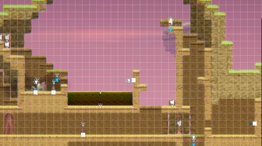

# COMP2150  - Level Design Document
### Name: [Soo Hwan Kim]
### Student number: [47517891] 

Total word count: 1517 words 

## 1. Player Experience (760 words)

### 1.1. Discovery (246 words) 

The player learns how to better play the game, through the progression encouraging experimentation with various dynamics emerging from within the game's systems. Examples include the earlier sections’ obstacles teaching effective gauging of distances, and possibility of reaching the desired place. I encouraged this through the morphology of familiar scenes, first introducing the concepts in a safe and isolated manner, before widening its scope into alternate and combined uses. 

The first section demonstrates this, where players are introduced to the rules of damage and switches, and the verb of melee attacks. 

 

The player is expected to take damage while attempting this section, with the staff pickup right before it prompting the player to see how they can reach down and deal with the spitter. I isolated the idea of players being able to drop through platforms, and being able to deal damage, in order to familiarise them with the mechanic. 

The introduction of the chompers and aerial attacks in the section right above it reinforces this in a stressed scenario, teaching the player alternate uses of the verb, and encouraging it’s combination with the jump verb. Additionally, players learn the approximate parameters of the jump verb, and how to modulate such, through the spike section just after it. 

![A chamber comprised of 2 sections, upper and lower. The lower section has a sheer cliff leading up to the upper, with a segment on the right and a singular floating block leading to it, occupied by a chomper. The floor is occupied by a chomper, and a chomper spawner. The upper section is a flat area with a block on it, and a pressure plate on the right. Connecting those two is another cliff that has spikes set in indents on its side. Health pickups are just below these spikes, which the knockback from those spikes seem to push the player into.](DocImages/FirstSectionParamsExample.png)

I designed the geometry of the room to make the spikes' knockback push the player into one of the health pickups, helping to maintain a flow state as they attempt to discover ways to get through the spikes. 

### 1.2. Drama (185 words) 

My design invokes Drama through use and exploration of the known to influence the player's experiential arc. This is primarily done through the modulation of physical, perceptive, and intellectual challenge over time, through the player's movement through the spacce given. 

Borrowing from the Gamer Motivation Model, I focused on the target experience of Mastery to inform my design process in modulating difficulty, creating first smaller subscenes for players to learn at a lower intensity, before raising it in later sections through demanding alternate and combined use of verbs. To create breaks from such tension, I used the connective spaces between spaces to create resonance, through the environmental design, with scenic sections the player had to walk through to get to the next parts of the game. 

 

Additionally, I subverted this resonance after this scene, through heavy usage of spikes creating a dodging challenge that, while not truly threatening, as the health pickups just prior and after this scene create little risk for the player objectively, the drastic increase in spikes, and subversion of what felt like a "safe space", created anticipation for the sections ahead. 

 

### 1.3. Challenge (143 words) 

I designed for intellectual, perceptual, and physical challenge through the space of the level, balanced through isolated segments comprising a whole, to allow players to explore the various verbs given to them, before showing alternative uses, then demanding players to combine various verbs to successfully complete the later sections, composed of the same ideas shown prior, fitting with the dramatic arc of the level laid out previously.

Through this approach, players acquired the intrinsic skills to overcome these challenges through this approach. The precision section of Level 3 demonstrates this, taking the delayed jump movement from the spikes in the first section, the breakable walls from the first section of the second level, and the crouch shooting from the run and gun section in the latter part of the second level, creating a composite challenge that suited their physical abilities at that stage. 

 

 

 

### 1.4. Exploration (186 words) 

My design invoked exploration through autonomy in the ways the player could overcome the obstacles presented, and in the optional section presented. I furthered this through the aesthetic shifts in each section, to add to moments within the game's dramatic arc, thereby creating distinct and memorable spaces, and to reward curiosity. 

I furthered the dramatic arc with different environments, moving through general cave structures, to open atmosphere areas, to crystal mines, to correlate with the rising tension and releases found within the game's difficulty curve. Through this variety in aesthetic environments, I encouraged curiosity in upcoming sections. 

 

 

 

The secret section adds to memorability, as it rewards player curiosity, requiring “replaying” the level, in order to activate the switches necessary. Accessing this provided the player with alternate views of the level, and a moving platform that allowed the player to "touch the moon”, creating a scenic experience. Players were expected to forget about this section until they reached the end door, upon which the second switch reminded and incentivised curious players, by providing audio incentive, to go back to see what else the game had to offer. 

 

 

 

 

## 2. Core Gameplay (317 words) 

### 2.1. Passthrough Platforms, Spitters, Weapon pickup, Health Pickups (114 words) 

 

This section was chosen to be first, to quick start action which primed player expectations, and created a more active dynamic between players and enemies. The passthrough platform was something I felt had to be introduced hard and fast, so the spitter was introduced here to provide incentive to get down there quickly. Additionally, this section taught the player about switches, and what they can do, something that came up a lot in my design that I felt was important the player came to terms with quickly. 

I added the health pickup here, expecting players to get hit, and would discover this mechanic organically when interacting with the switch, and vice versa. 

 

### 2.2. Chompers, Spikes, Keys (105 words) 

 

The chompers were introduced alongside the basics of platforming, to expand the dynamic established previously, and to get the player used to dealing with them alongside other obstacles. Due to the geometry, the chompers appear threatening due to their proximity, but are easily either avoided or killed by the player's superior mobility. 

The spikes in this section built off the basics of platforming presented just before, teaching input precision, another cornerstone of the game I felt players needed to be accustomed to early. The key was introduced here as both a reward for overcoming this section, and to inform the player of the expected pacing. 

 

### 2.3. Acid, Checkpoints, Moving Platforms (147 words) 

 

As the player had learned the basic rules of this game’s platforming, I introduced the acid to build off it, and introduced the properties of the respawn point to iron out ideas the player would have over the platforming system’s values. While a checkpoint was available earlier, the first use appears here, as I expect the player to first attempt the jump over the acid. As the player respawned, I expected them to then explore the area, and see if they could break the wall that was ahead. 

The placement of the checkpoint reinforced this, by making the player walk further to return to the same point, giving atmosphere for players to think of alternate solutions. Platforms were first introduced with a pressure plate activation to highlight triggers in a familiar environment, then with a gun-accessed switch, to set up for the run and gun section ahead. 

 

### 2.4. Weapon Pickup (Gun) (51 words) 

 

While the gun was technically introduced in the section just before, its properties were introduced more holistically in this section, combining it with enemies in situations that demanded both ranged and melee attacks, and a unique application of the pressure plates by removing existing weight, to stress test the player's knowledge. 

 

## 3. Spatiotemporal Design 
 
### 3.1. Molecule Diagram

 

### 3.2. Level Map – Section 1

 

 

### 3.3.	Level Map – Section 2

 

 

 

### 3.4.	Level Map – Section 3

 

 

 

 

## 4. Iterative Design (440 words)

I used iterative design to improve the technical and experiential goals I had set out to achieve, by fine tuning with respect to player experience. 

An example of this was in the early stages of planning the run and gun section, where the way to get to the enemy plates felt unfair, as the spike in the corner was not noticeable enough, which knocked the player into the enemies, disrupting the flow of the game unfairly. 

 

I improved this by removing the spikes, creating a smoother gameplay experience. 

 

This iteration was much needed, as my paper prototype did not account for this area. 

 

While greybox playtesting, a softlock was found by pushing the block from the first section off the platform. After consideration, I decided there was no way to implement this without designing for this case, and with the platforms in the acid section introducing the player to platforms, I used this information to change the platform to a corridor. Working with this, I instead implemented the break in the final area. 

 

 

 

My initial idea of a section based around movement manipulation via the 1 block distance gained from swinging the staff were scrapped after all my playtesters failed to bridge the 1 block gap in the chomper section. From this, I gathered it unfair to be mandatory, as laid out in my initial plans for the first section. However, I felt players should be rewarded for discovering this and wanting to use it, so I implemented it as an alternate pathing for the final precision section, rewarding mastery over this physical challenge. 

 

 

 

 

1 playtester did not realise the wall in section 1 of level 2 was breakable, I fixed this by replacing it with a column, and adding a different background tile around it, as well as indicating it by sinking it further into the wall it was placed in, creating a visual indicator that there was an area there. 

 

 

Additionally, I found that the level felt too artificial, which hindered exploration. To counter this, I implemented the hidden sections later on, giving players another path they could possibly go back to. 

 

I could have iterated more on the distribution of healing, as better use of player health as a decision making factor would lead to more precise sections in regard to player-centric design principles, key of which being better accounting for various player mental states and their subsequent reactions to risk. A section that could have benefited from this is the final precision section, where the alternate route mentioned above could have had more dimensions in skill, allowing for more accessible freedom in navigating that space. 
